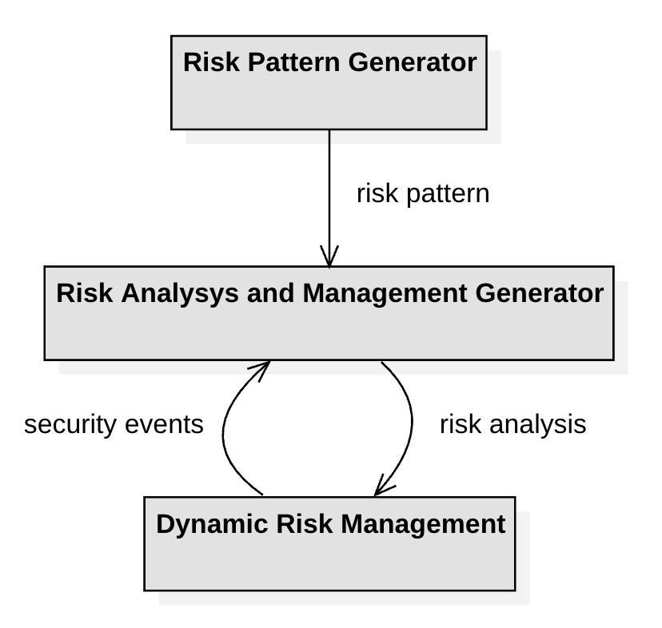
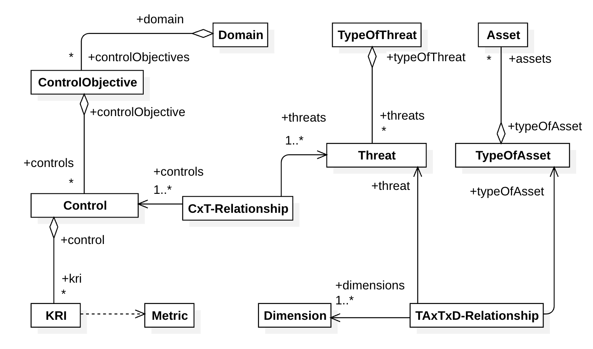
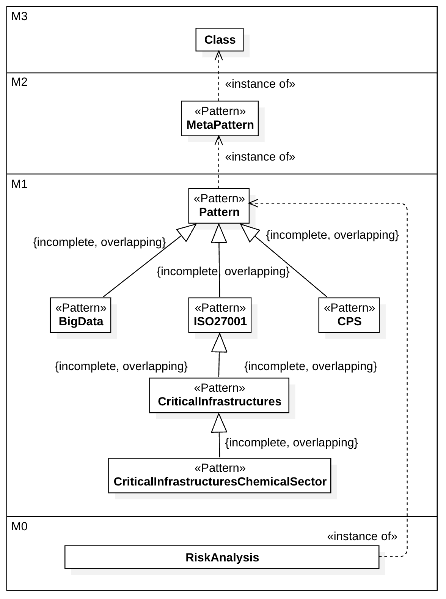

# MARISMA-patterns

# Marisma Patterns

## Introduction

Marisma Patterns is a comprehensive framework designed for the sustainability and management of cybersecurity risks. It provides a base framework that can be extended with specific patterns tailored to various application domains. The goal is to offer a reusable and adaptable methodology for assessing and managing risks in diverse environments.

## Purpose

The primary purpose of Marisma Patterns is to facilitate dynamic and adaptive risk management. By utilizing a base framework and extending it with specific patterns, organizations can address the unique risks and requirements of different domains, ensuring comprehensive and effective risk management.

## Key Elements

### Base Framework
- **Reusable Meta-pattern**: A generic structure that defines the main elements and interdependencies of a risk analysis and management (RAM) process.
- **Supporting Method**: Guides the entire process of risk assessment and management.
- **Cloud-based Tool**: Automates data management and risk analysis methods, making the process more efficient and effective.

### Extensible Patterns
Marisma Patterns can be extended with specific patterns to cater to different domains. Here are some examples:

#### 1. MARISMA-CPS (Cyber-Physical Systems)
- Focuses on managing cybersecurity risks in CPS, which include engineered networks of physical and computational components.
- Incorporates elements such as safety, security, privacy, reliability, and resilience.
- Aligns with main CPS frameworks like those defined by NIST and ENISA.

#### 2. MARISMA-BIDA (Big Data)
- Tailored for Big Data environments, focusing on the unique risks associated with large-scale data processing and storage.
- Supports dynamic learning and knowledge reuse to adapt to evolving data landscapes.

## How to Use

Organizations can implement Marisma Patterns by:
1. **Adopting the Base Framework**: Utilize the meta-pattern and supporting method to establish a foundational risk management process.
2. **Extending with Specific Patterns**: Customize the framework with domain-specific patterns to address unique risks and requirements.
3. **Using the Cloud-based Tool**: Leverage the eMARISMA tool to automate and streamline risk assessment and management tasks.

